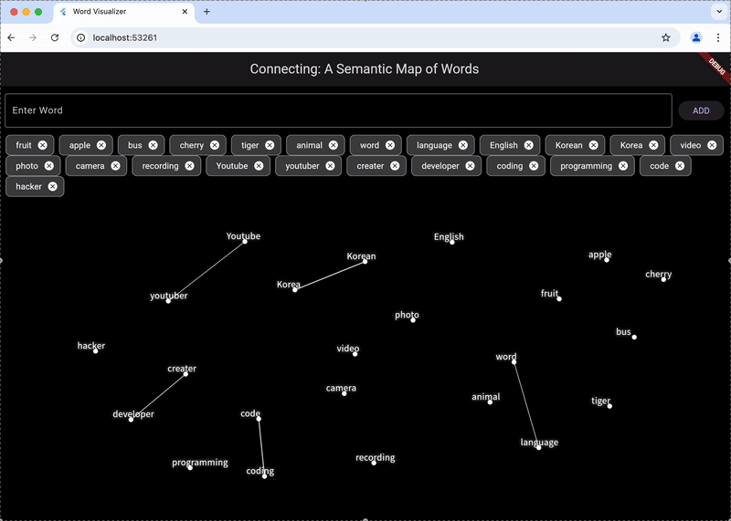

# 🌌 Connecting: A Semantic Map of Words

**Connecting** is a web-based interactive visualization tool that maps words in a 2D space by semantic similarity — like drawing constellations in the night sky ✨  
It helps you explore the relationships between words visually, intuitively, and beautifully.

---
<br>

## 🧩 Features

- 🔤 Input words in Korean, English, or 100+ languages supported by LaBSE
- 📐 Visualize words in 2D using UMAP for dimensionality reduction
- 💬 Semantically similar words appear closer together
- 🌌 Words are connected with lines if they are semantically similar (based on cosine similarity)
- 🪐 Force-directed layout prevents overlapping through repulsion physics
- ✨ Night sky theme with glowing word “stars”

---
<br>

## 💡 Why I built this project

During my exchange program, I had conversations with international friends about our native languages.  
We talked about how the word **"Go"** is expressed differently—for example, in Korean, it's **"가자"**—and we started wondering how it's said in Japanese, Chinese, and other languages.

That led to an idea: what if there were a visual map that connects words with the same meaning across different languages?

This idea eventually became the foundation of **Connecting**, a project I built from scratch.

---
<br>

## 🛠 Tech Stack

### Frontend (Flutter Web)
- Flutter (3.x)
- `InteractiveViewer` + `CustomPaint` for visualization
- REST API integration (`http` package)

### Backend (FastAPI)
- [`sentence-transformers/LaBSE`](https://www.sbert.net/docs/pretrained_models.html#labse) for multilingual embeddings
- `scikit-learn` for similarity computation
- `umap-learn` for dimensionality reduction
- CORS enabled (for communication with Flutter frontend)

---
<br>

## 🚀 Getting Started

### 🔧 Backend Setup (Python 3.10+)

```bash
cd server
pip install -r requirements.txt
uvicorn app:app --host 0.0.0.0 --port 10000 --reload
```

> Server will run at `http://localhost:10000`

### 🧪 Example API Request

**POST** `/vectorize`
```json
{
  "words": ["apple", "banana", "사과", "바나나"]
}
```

---

### 💻 Frontend Setup (Flutter)

```bash
cd connecting
flutter pub get
flutter run -d chrome
```

> App runs on `http://localhost:5500` or similar

---
<br>

## 📸 Screenshot

**Multilingual Support**


**Connecting words**


**Delete word**


**Pan the screen**


---
<br>

## 📄 License

MIT License © 2025 HwangGoeun

---
<br>

## 🙌 Acknowledgements

- [SentenceTransformers (LaBSE)](https://www.sbert.net/docs/pretrained_models.html#labse)
- [UMAP](https://umap-learn.readthedocs.io/en/latest/)
- [Flutter](https://flutter.dev)
- [FastAPI](https://fastapi.tiangolo.com)
